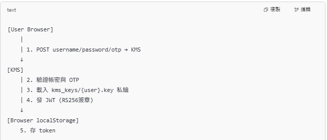
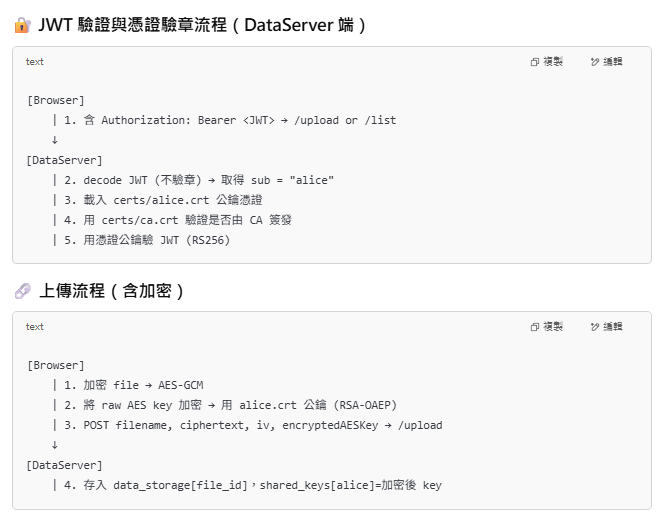
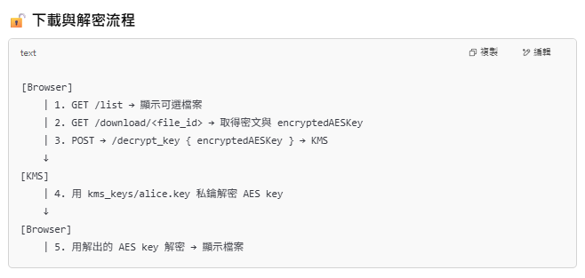
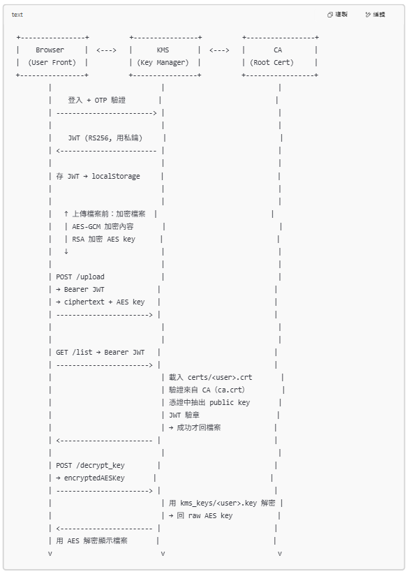
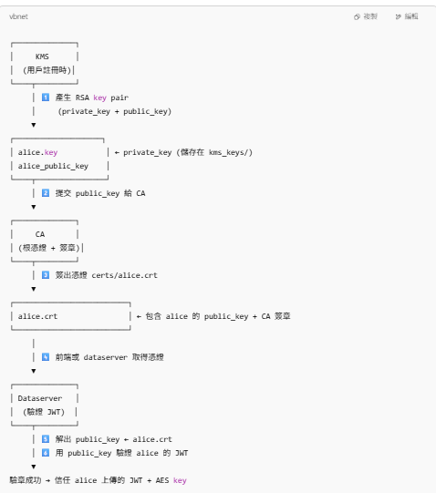

# cse_cipher_game_pro_final_project

How to run this code?
# 建立 ca.key + ca.crt
`python ca_tools.py init_ca`
# KMS生成私鑰 和 C
`python ca_tools.py gen_user alice`
# 為 alice 建立 alice.key + alice.crt
`python ca_tools.py sign alice`
# 生成 public.pem ( 從使用者憑證對應的私鑰中匯出公鑰 )
`python ca_tools.py export_spki alice` 

# in terminal 1
`python kms.py`

# in terminal 2
`python dataserver.py`

dataserver.py 驗證 JWT 時使用的是憑證中的公鑰

流程圖和架構圖:

